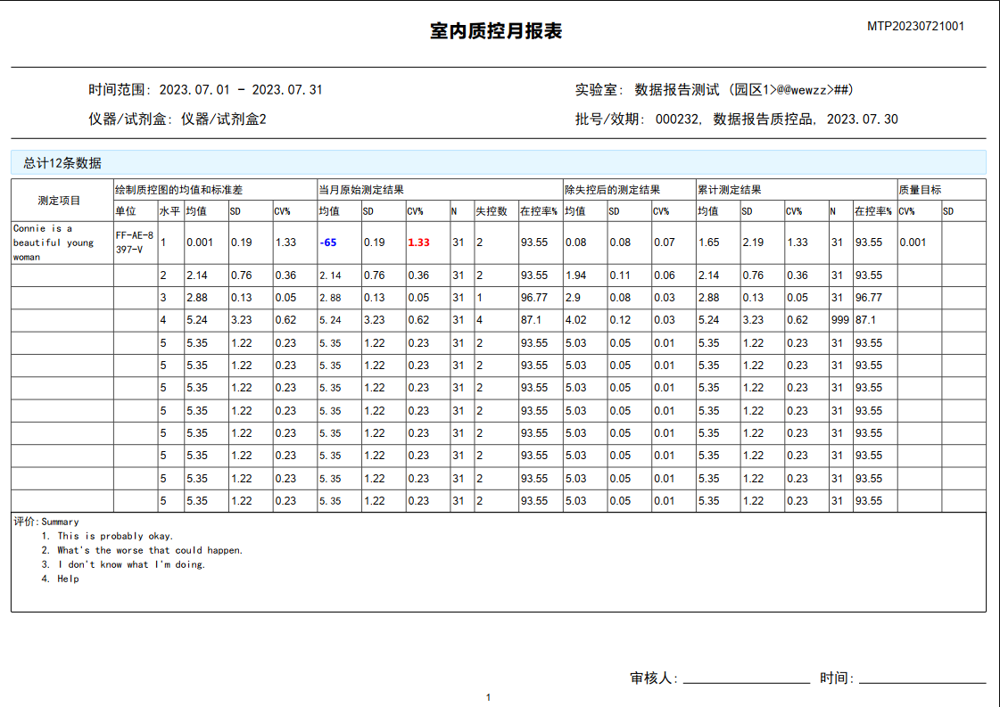
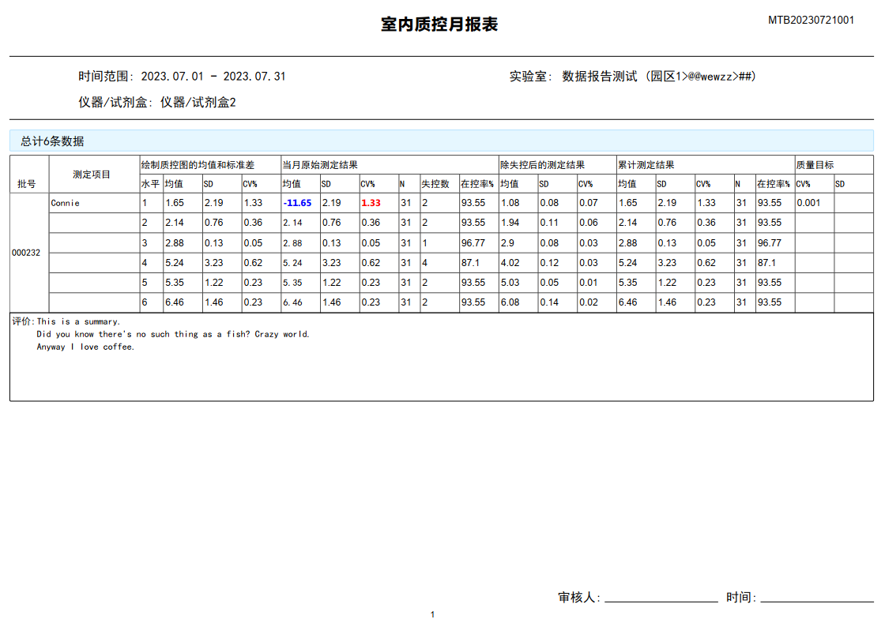
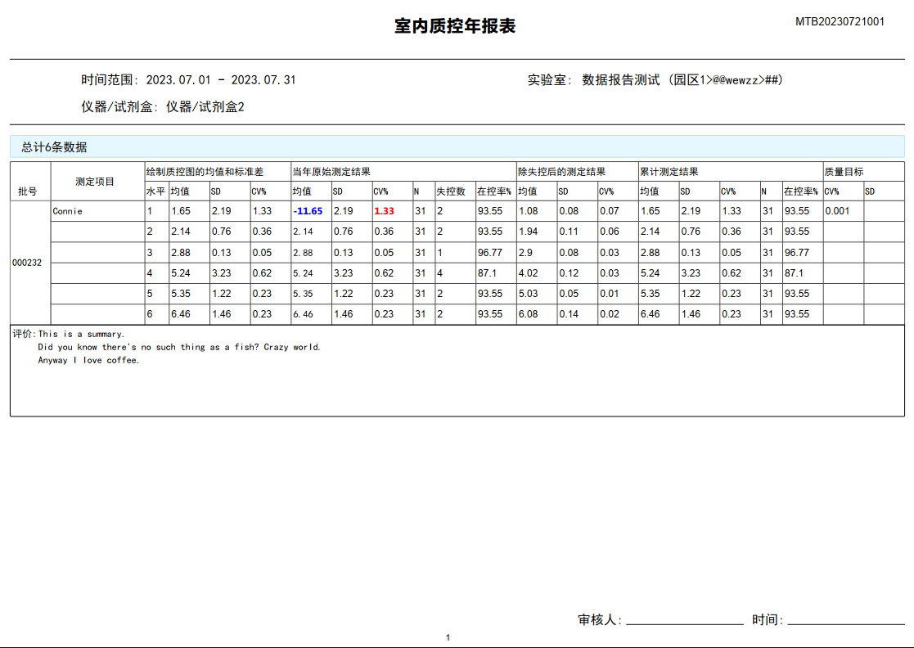
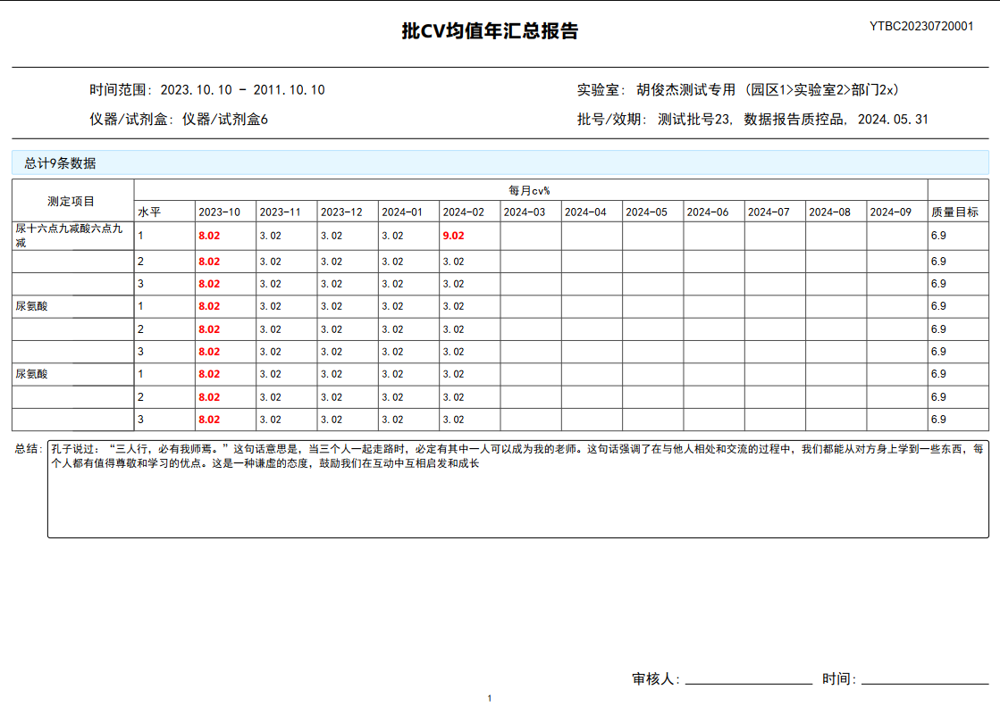

# PDF Report Generation

This documentation provides an overview of the code responsible for generating PDF reports as part of the IVD (In Vitro Diagnostic) data management program. These reports are used for quality control processes and leverage the ReportLab library for PDF generation.

## Table of Contents

1. [Introduction](#introduction)
2. [Functionality](#functionality)
3. [Output Examples](#output-examples)

## Introduction

The IVD data management system includes a module for generating PDF reports to facilitate the quality control process. This module utilizes the ReportLab library, a powerful tool for creating dynamic PDF documents.

## Functionality

The PDF report generation module provides the following functionality:

- **Monthly and Yearly Project Quality Control Reports:** These reports show the quality control results for different projects on a monthly and yearly basis.

- **Monthly and Yearly Batch Quality Control Reports:** These reports detail the quality control outcomes in batches.

- **Yearly CV Quality Control Reports:** These reports specifically focus on Coefficient of Variation (CV) quality control metrics on a yearly basis.

## Output Examples

Here are examples of the generated PDF reports for different report types:

Note that the difference between the monthly and yearly versions of these reports is merely changing the word "month" to "year" wherever it appears. In addition, even though all the screenshots provided are one page, the program can generate any number of pages.

1. Monthly Project Quality Control Report:
   

2. Yearly Project Quality Control Report:
   

3. Monthly Batch Quality Control Report:
   

4. Monthly Batch Quality Control Report:
   

5. Yearly CV Quality Control Report:
   

Please refer to the codebase for the specific implementation details and how to generate these reports.
